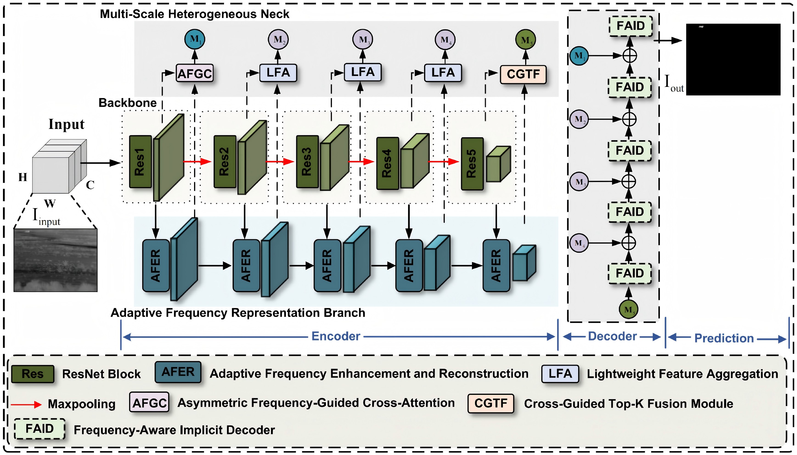

# SFC-INRNet: Spatial-Frequency Collaborative Implicit Representation for IRSTD

[](#)
[](https://opensource.org/licenses/MIT)
[](#)

> **Official PyTorch Implementation** of "Spatial-Frequency Collaborative Implicit Representation for Infrared Small Target Detection".
> 
> **Authors:** Zicheng Xu
> 
> **Institution:** School of Mechanical Engineering, Tiangong University, Tianjin, China.

---

## 📢 Abstract
Infrared small target detection (IRSTD) is a critical task in visual surveillance systems, yet challenged by weak target signals and complex background clutter. Existing methods mostly focus on spatial feature learning and neglect frequency-domain information, while discrete upsampling causes detail loss for tiny targets. 

Here we propose **SFC-INRNet**, a spatial-frequency collaborative implicit neural representation framework. The method uses a dual-domain encoder to extract spatial and frequency features, a scale-aware heterogeneous fusion module to integrate cross-domain features, and a continuous implicit decoder to realize high-fidelity small target reconstruction.

## 💡 Introduction
We present the SFC-INRNet framework tailored for the IRSTD task. Our main contributions are as follows:

1. **Unified Pipeline**: We bridge the gap between spatial semantics and frequency-domain saliency via a dual-domain collaborative encoder.
2. **Frequency Enhancement**: An **AFER** module is utilized to dynamically mine and enhance high-frequency target signals.
3. **Implicit Decoding**: A **FAID** decoder reformulates upsampling as continuous function regression to achieve sub-pixel, high-fidelity reconstruction.

---

## 🏗️ Network Architecture

<div align="center">
  
  <p align="center">
    <b>Fig. 1. Overall architecture of the proposed SFC-INRNet.</b>
  </p>
</div>

---

## 🖼️ Visual Results

### 1. Qualitative Comparisons
Our method exhibits superior performance in suppressing complex clutter and accurately delineating target boundaries compared to state-of-the-art methods.

<div align="center">
  
  <p align="center">
    <b>Fig. 2. Visual comparison of SFC-INRNet against other SOTA methods on various datasets.</b>
  </p>
</div>

### 2. Ablation Study Visualization
Visualizations demonstrate that each module (AFER, MSHN, FAID) contributes significantly to the final high-fidelity mask.

<div align="center">
  
  <p align="center">
    <b>Fig. 3. Visualized ablation studies highlighting the effectiveness of core components.</b>
  </p>
</div>

---

## 🏆 Quantitative Results
SFC-INRNet achieves SOTA performance across public benchmark datasets:

| Dataset | IoU (%) | nIoU (%) | F-measure (%) | Pd (%) | Fa (×10⁻⁶) |
| :--- | :---: | :---: | :---: | :---: | :---: |
| **NUDT-SIRST** | 94.84 | 95.04 | 96.94 | 99.04 | 2.284 |
| **NUAA-SIRST** | 76.94 | 80.16 | 86.97 | 94.18 | 14.25 |
| **IRSTD-1K** | 65.53 | 65.12 | 79.54 | 92.23 | 32.35 |

---

## 🚀 Usage Guide

### 1. Environment Preparation
Configure the environment using the provided `requirements.txt`:
```bash
conda create -n sfcinr python=3.8
conda activate sfcinr
pip install -r requirements.txt
